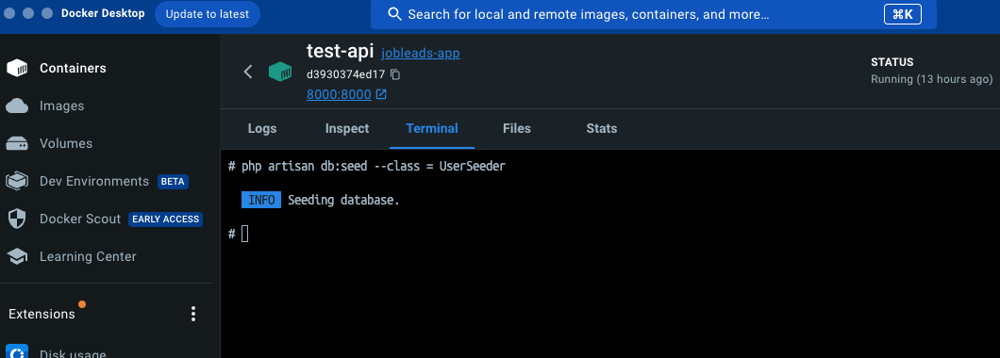

## About Laravel

Laravel is a web application framework with expressive, elegant syntax. We believe development must be an enjoyable and creative experience to be truly fulfilling. Laravel takes the pain out of development by easing common tasks used in many web projects, such as:

- [Simple, fast routing engine](https://laravel.com/docs/routing).
- [Powerful dependency injection container](https://laravel.com/docs/container).
- Multiple back-ends for [session](https://laravel.com/docs/session) and [cache](https://laravel.com/docs/cache) storage.
- Expressive, intuitive [database ORM](https://laravel.com/docs/eloquent).
- Database agnostic [schema migrations](https://laravel.com/docs/migrations).
- [Robust background job processing](https://laravel.com/docs/queues).
- [Real-time event broadcasting](https://laravel.com/docs/broadcasting).

Laravel is accessible, powerful, and provides tools required for large, robust applications.

## Steps to run the project backend

1. `git clone git@github.com:khemrajregmi/LaravelNuxtCrud.git` if you are using ssh clone else with HTTPS `git clone https://github.com/khemrajregmi/LaravelNuxtCrud.git`

2. `cd LaravelNuxtCrud`

3. `Copy .env.example to .env`

4. Run ` composer install` in terminal

5. Run `php artisan key:generate`
   
7. Run `Docker compose up --build`

## Run Migration and Seeders inside the docker container 
    1. click container name called test-api 

    2. Click on the terminal tab and run the following commands

    Run `php artisan migrate`

    Run `php artisan config:publish cors`

    Run `php artisan db:seed --class = CustomerSeeder`

## Steps to run the project frontend

goto(cd) backend>resources>js>frontend

Run the following commands in terminal

     `yarn install`

     `yarn dev`

you can access the demo https://www.loom.com/share/c1cf471efdbf46f09f5efd1c6c135328?sid=073f813e-9897-4074-985f-6092323aaae2
## License
The Laravel framework is open-sourced software licensed under the [MIT license](https://opensource.org/licenses/MIT).
